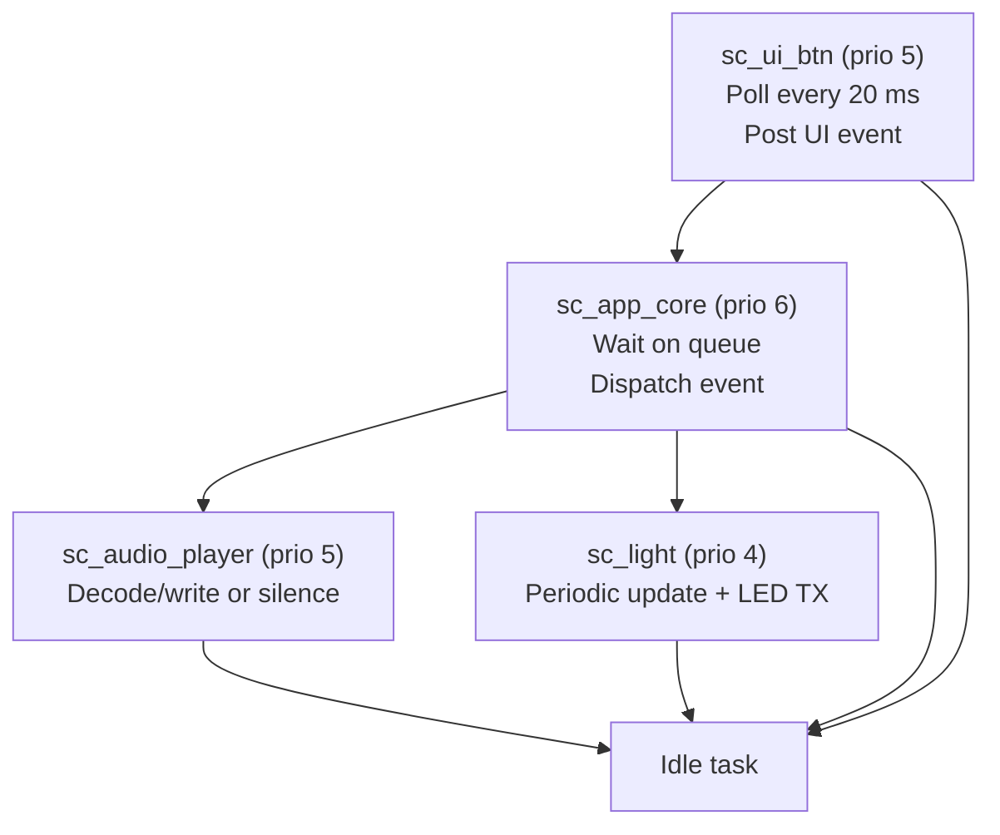

# SleepCube P0 RTOS Task Schedule (Simplified)

## Purpose

Provide a simple, readable visualization of how FreeRTOS task switching is intended to work
in the current PoC build.

## Task Set

| Task | Priority | Trigger / Wait Condition | Main Work |
| --- | --- | --- | --- |
| `sc_app_core` | 6 | `xQueueReceive(..., portMAX_DELAY)` | Dispatches UI events to audio/light services |
| `sc_ui_btn` | 5 | `vTaskDelay(20 ms)` | Polls GPIO buttons and posts events |
| `sc_audio_player` | 5 | Runs continuously; decode/write when enabled | MP3 decode + I2S writes; silence output when disabled |
| `sc_light` | 4 | `vTaskDelayUntil(period)` | Brightness/effect update + LED frame submit |
| `sc_ui` (optional LCD backend) | 4 | `vTaskDelay(5000 ms)` | Placeholder heartbeat for LCD/touch backend |

## Scheduler View

## Example Preemption Timeline

This is a conceptual scheduler timeline (not captured trace data). It visualizes
how priority-based switching works when a button event arrives while other tasks run.

```mermaid
gantt
    title FreeRTOS preemption example (conceptual)
    dateFormat  X
    axisFormat %L ms

    section prio 6
    app_core dispatch            : 20, 4ms

    section prio 5
    ui_btn poll + post event     : 18, 2ms
    audio_player decode chunk    : 0, 20ms
    audio_player resume          : 24, 12ms

    section prio 4
    light update slice           : 8, 6ms
    light update delayed         : 36, 6ms

    section idle
    idle                         : 42, 8ms
```

Timeline interpretation:
- `audio_player` runs at priority 5.
- `ui_btn` wakes at priority 5 and posts an event.
- `app_core` (priority 6) preempts immediately and dispatches control action.
- Lower priority `light` task (priority 4) only runs when higher-priority tasks are blocked/delayed.

## Practical Notes

- `sc_app_core` has the highest priority and runs immediately when an event is posted.
- `sc_ui_btn` and `sc_audio_player` share priority 5; switching between them is cooperative/time-sliced.
- `sc_light` runs at lower priority and updates periodically.
- Actual timing still depends on tick rate (`CONFIG_FREERTOS_HZ`) and blocking behavior in drivers.

## When To Use Full Trace

Use the detailed `sc_trace` timeline only when debugging jitter, starvation, or latency spikes.
For normal architecture understanding, this simplified schedule is the recommended view.
