# SleepCube P0 Task Timing Diagram

- Source log: `trace.log`
- Window: first `15000` ms of parsed trace data

```mermaid
gantt
    title SleepCube P0 Task Schedule (trace-derived)
    dateFormat  X
    axisFormat %Lms
    section app_core
    section audio
    section light
    run_1 : 0, 6ms
    run_2 : 40, 6ms
    run_3 : 90, 1ms
    run_4 : 140, 1ms
    run_5 : 190, 1ms
    run_6 : 240, 1ms
    run_7 : 290, 1ms
    run_8 : 340, 1ms
    run_9 : 390, 1ms
    run_10 : 440, 1ms
    run_11 : 490, 1ms
    run_12 : 540, 1ms
    run_13 : 590, 1ms
    run_14 : 640, 1ms
    run_15 : 690, 1ms
    run_16 : 740, 1ms
    run_17 : 790, 1ms
    run_18 : 840, 1ms
    run_19 : 890, 1ms
    run_20 : 940, 1ms
    run_21 : 990, 1ms
    run_22 : 1040, 1ms
    run_23 : 1090, 1ms
    run_24 : 1140, 1ms
    run_25 : 1190, 1ms
    run_26 : 1240, 1ms
    run_27 : 1290, 1ms
    run_28 : 1340, 1ms
    run_29 : 1390, 1ms
    run_30 : 1440, 1ms
    run_31 : 1490, 1ms
    run_32 : 1540, 1ms
    run_33 : 1590, 1ms
    run_34 : 1640, 1ms
    run_35 : 1690, 1ms
    run_36 : 1740, 1ms
    run_37 : 1790, 1ms
    run_38 : 1840, 1ms
    run_39 : 1890, 1ms
    run_40 : 1940, 1ms
    run_41 : 1990, 1ms
    run_42 : 2040, 1ms
    run_43 : 2090, 1ms
    run_44 : 2140, 1ms
    run_45 : 2190, 1ms
    run_46 : 2240, 1ms
    run_47 : 2290, 1ms
    run_48 : 2340, 1ms
    run_49 : 2390, 1ms
    run_50 : 2440, 1ms
    run_51 : 2490, 1ms
    run_52 : 2540, 1ms
    run_53 : 2590, 1ms
    run_54 : 2640, 1ms
    run_55 : 2690, 1ms
    run_56 : 2740, 1ms
    run_57 : 2790, 1ms
    run_58 : 2840, 1ms
    run_59 : 2890, 1ms
    run_60 : 2940, 1ms
    run_61 : 2990, 1ms
    run_62 : 3040, 1ms
    run_63 : 3090, 1ms
    run_64 : 3140, 1ms
    run_65 : 3190, 1ms
    run_66 : 3240, 1ms
    run_67 : 3290, 1ms
    run_68 : 3340, 1ms
    run_69 : 3390, 1ms
    run_70 : 3440, 1ms
    run_71 : 3490, 1ms
    run_72 : 3540, 1ms
    run_73 : 3590, 1ms
    run_74 : 3640, 1ms
    run_75 : 3690, 1ms
    run_76 : 3740, 1ms
    run_77 : 3790, 1ms
    run_78 : 3840, 1ms
    run_79 : 3890, 1ms
    run_80 : 3940, 1ms
    run_81 : 3990, 1ms
    run_82 : 4040, 1ms
    run_83 : 4090, 1ms
    run_84 : 4140, 1ms
    run_85 : 4190, 1ms
    run_86 : 4240, 1ms
    run_87 : 4290, 1ms
    run_88 : 4340, 1ms
    run_89 : 4390, 1ms
    run_90 : 4440, 1ms
    run_91 : 4490, 1ms
    run_92 : 4540, 1ms
    run_93 : 4590, 1ms
    run_94 : 4652, 1ms
    run_95 : 4690, 1ms
    run_96 : 4740, 1ms
    run_97 : 4790, 1ms
    run_98 : 4840, 1ms
    run_99 : 4890, 1ms
    run_100 : 4940, 1ms
    run_101 : 4990, 1ms
    run_102 : 5040, 1ms
    run_103 : 5093, 1ms
    run_104 : 5142, 1ms
    run_105 : 5196, 1ms
    run_106 : 5240, 1ms
    run_107 : 5290, 1ms
    run_108 : 5340, 1ms
    run_109 : 5390, 1ms
    run_110 : 5440, 1ms
    run_111 : 5490, 1ms
    run_112 : 5540, 1ms
    run_113 : 5590, 1ms
    run_114 : 5643, 1ms
    run_115 : 5692, 1ms
    run_116 : 5746, 1ms
    run_117 : 5795, 1ms
    run_118 : 5840, 1ms
    run_119 : 5890, 1ms
    run_120 : 5940, 1ms
    run_121 : 5990, 1ms
    run_122 : 6040, 1ms
    run_123 : 6090, 1ms
    run_124 : 6140, 1ms
    run_125 : 6190, 1ms
    run_126 : 6242, 1ms
    run_127 : 6296, 1ms
    run_128 : 6345, 1ms
    run_129 : 6390, 1ms
    run_130 : 6440, 1ms
    run_131 : 6490, 1ms
    run_132 : 6540, 1ms
    run_133 : 6590, 7ms
    run_134 : 6640, 1ms
    run_135 : 6690, 1ms
    run_136 : 6740, 1ms
    run_137 : 6790, 1ms
    run_138 : 6840, 1ms
    run_139 : 6890, 1ms
    run_140 : 6940, 1ms
    run_141 : 6990, 1ms
    run_142 : 7040, 1ms
    run_143 : 7090, 1ms
    run_144 : 7140, 1ms
    run_145 : 7190, 1ms
    run_146 : 7240, 1ms
    run_147 : 7290, 1ms
    run_148 : 7340, 1ms
    run_149 : 7390, 1ms
    run_150 : 7440, 1ms
    run_151 : 7490, 1ms
    run_152 : 7540, 1ms
    run_153 : 7590, 1ms
    run_154 : 7640, 1ms
    run_155 : 7690, 1ms
    run_156 : 7740, 1ms
    run_157 : 7790, 1ms
    run_158 : 7840, 1ms
    run_159 : 7890, 1ms
    run_160 : 7940, 1ms
    run_161 : 7990, 1ms
    run_162 : 8040, 1ms
    run_163 : 8090, 1ms
    run_164 : 8140, 1ms
    run_165 : 8190, 1ms
    run_166 : 8240, 1ms
    run_167 : 8290, 1ms
    run_168 : 8340, 1ms
    run_169 : 8390, 1ms
    run_170 : 8440, 1ms
    run_171 : 8490, 1ms
    run_172 : 8540, 1ms
    run_173 : 8590, 1ms
    run_174 : 8640, 1ms
    run_175 : 8690, 1ms
    run_176 : 8740, 1ms
    run_177 : 8797, 5ms
    run_178 : 8840, 1ms
    run_179 : 8892, 1ms
    run_180 : 8941, 1ms
    run_181 : 8995, 1ms
    run_182 : 9045, 1ms
    run_183 : 9090, 1ms
    run_184 : 9140, 1ms
    run_185 : 9190, 1ms
    run_186 : 9240, 1ms
    run_187 : 9290, 1ms
    run_188 : 9340, 1ms
    run_189 : 9390, 1ms
    run_190 : 9440, 1ms
    run_191 : 9490, 1ms
    run_192 : 9545, 1ms
    run_193 : 9594, 1ms
    run_194 : 9640, 1ms
    run_195 : 9690, 8ms
    run_196 : 9740, 1ms
    run_197 : 9790, 1ms
    run_198 : 9840, 1ms
    run_199 : 9890, 1ms
    run_200 : 9940, 1ms
    run_201 : 9990, 1ms
    run_202 : 10041, 1ms
    run_203 : 10090, 1ms
    run_204 : 10144, 1ms
    run_205 : 10190, 1ms
    run_206 : 10247, 1ms
    run_207 : 10290, 1ms
    run_208 : 10340, 1ms
    run_209 : 10390, 1ms
    run_210 : 10440, 1ms
    run_211 : 10490, 1ms
    run_212 : 10540, 1ms
    run_213 : 10590, 1ms
    run_214 : 10640, 1ms
    run_215 : 10693, 1ms
    run_216 : 10742, 1ms
    run_217 : 10796, 1ms
    run_218 : 10840, 1ms
    run_219 : 10890, 1ms
    run_220 : 10947, 32ms
    run_221 : 10990, 1ms
    run_222 : 11040, 1ms
    run_223 : 11090, 1ms
    run_224 : 11140, 1ms
    run_225 : 11190, 1ms
    run_226 : 11240, 1ms
    run_227 : 11290, 1ms
    run_228 : 11340, 1ms
    run_229 : 11390, 1ms
    run_230 : 11440, 1ms
    run_231 : 11490, 1ms
    run_232 : 11540, 1ms
    run_233 : 11590, 1ms
    run_234 : 11640, 1ms
    run_235 : 11690, 1ms
    run_236 : 11740, 1ms
    run_237 : 11790, 1ms
    run_238 : 11840, 1ms
    run_239 : 11890, 1ms
    run_240 : 11940, 1ms
    run_241 : 11990, 1ms
    run_242 : 12040, 1ms
    run_243 : 12090, 1ms
    run_244 : 12140, 1ms
    run_245 : 12190, 1ms
    run_246 : 12240, 1ms
    run_247 : 12290, 1ms
    run_248 : 12340, 1ms
    run_249 : 12390, 1ms
    run_250 : 12440, 1ms
    run_251 : 12490, 1ms
    run_252 : 12540, 1ms
    run_253 : 12590, 1ms
    run_254 : 12640, 1ms
    run_255 : 12690, 1ms
    run_256 : 12740, 1ms
    run_257 : 12790, 1ms
    run_258 : 12840, 1ms
    run_259 : 12890, 1ms
    run_260 : 12940, 1ms
    run_261 : 12990, 1ms
    run_262 : 13040, 1ms
    run_263 : 13090, 1ms
    run_264 : 13140, 1ms
    run_265 : 13190, 1ms
    run_266 : 13240, 1ms
    run_267 : 13290, 1ms
    run_268 : 13340, 1ms
    run_269 : 13390, 1ms
    run_270 : 13440, 1ms
    run_271 : 13490, 1ms
    run_272 : 13540, 1ms
    run_273 : 13590, 1ms
    run_274 : 13640, 1ms
    run_275 : 13690, 1ms
    run_276 : 13740, 1ms
    run_277 : 13790, 1ms
    run_278 : 13840, 1ms
    run_279 : 13890, 1ms
    run_280 : 13940, 1ms
    run_281 : 13990, 1ms
    run_282 : 14040, 1ms
    run_283 : 14090, 1ms
    run_284 : 14140, 1ms
    run_285 : 14190, 1ms
    run_286 : 14240, 1ms
    run_287 : 14290, 1ms
    run_288 : 14340, 1ms
    run_289 : 14390, 1ms
    run_290 : 14440, 1ms
    run_291 : 14490, 1ms
    run_292 : 14540, 1ms
    run_293 : 14590, 1ms
    run_294 : 14640, 1ms
    run_295 : 14690, 1ms
    run_296 : 14740, 1ms
    run_297 : 14790, 1ms
    run_298 : 14840, 1ms
    run_299 : 14890, 1ms
    run_300 : 14940, 1ms
    run_301 : 14990, 1ms
    section ui_btn
```

## Event Markers

| t (ms) | task | event | value |
| --- | --- | --- | --- |
| 52 | app_core | evt_rx | 0 |
| 57 | app_core | dispatch_start | 0 |
| 66 | app_core | dispatch_end | 0 |
| 4600 | ui_btn | emit | 1 |
| 4600 | app_core | evt_rx | 1 |
| 4600 | app_core | dispatch_start | 1 |
| 4607 | audio | play_start | 70 |
| 4616 | app_core | dispatch_end | 1 |
| 6570 | ui_btn | emit | 1 |
| 6570 | app_core | evt_rx | 1 |
| 6570 | app_core | dispatch_start | 1 |
| 6580 | app_core | dispatch_end | 1 |
| 6607 | audio | play_end | 0 |
| 6710 | audio | state_muted | 0 |
| 8770 | ui_btn | emit | 1 |
| 8770 | app_core | evt_rx | 1 |
| 8770 | app_core | dispatch_start | 1 |
| 8776 | audio | play_start | 70 |
| 8785 | app_core | dispatch_end | 1 |
| 10940 | ui_btn | emit | 1 |
| 10940 | app_core | evt_rx | 1 |
| 10940 | app_core | dispatch_start | 1 |
| 10956 | app_core | dispatch_end | 1 |
| 10967 | audio | play_end | 0 |
| 11070 | audio | state_muted | 0 |
